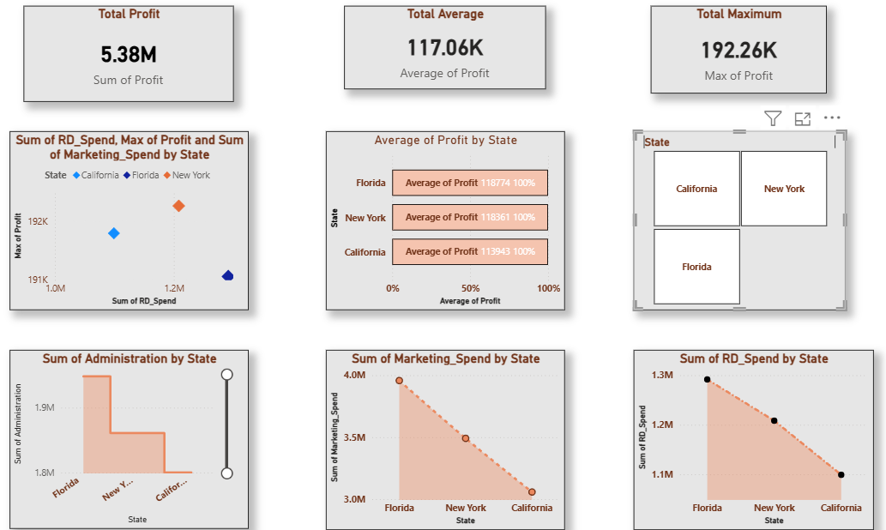
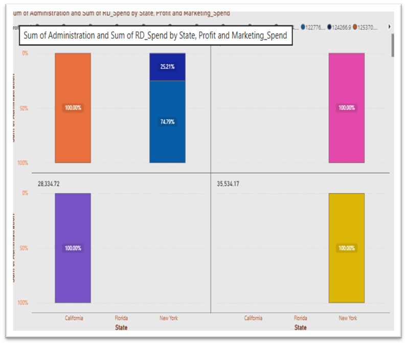

# Startup Profit Prediction using Multiple Linear Regression

## Business Problem
Investors and business analysts need to understand which spending areas 
(R&D, Administration, Marketing) most strongly influence a startup's profit, 
in order to make better investment decisions. This project builds a 
regression model to predict profit and identify the most influential factors.

## Dataset
- 50 Startups dataset — companies based in New York, California, and Florida
- Features: R&D Spend, Administration Spend, Marketing Spend, State, Profit

## Tools & Technologies
Python, Pandas, NumPy, Scikit-learn, Matplotlib, Power BI

## Dashboard Preview

## Approach
1. **Data Loading & Inspection** — Loaded the dataset and checked for missing 
   values, data types, and basic statistics.
2. **Data Preprocessing** — Encoded the categorical 'State' column into 
   numeric values using Label Encoding.
3. **Correlation Analysis** — Measured how strongly each spending category 
   relates to Profit.
4. **Model Building** — Applied Multiple Linear Regression, splitting data 
   80% training / 20% testing, to predict profit based on R&D Spend, 
   Administration Spend, Marketing Spend, and State.
5. **Model Evaluation** — Evaluated performance using R² Score, Mean 
   Absolute Error (MAE), and RMSE.
6. **Visualization** — Built 5 charts (Actual vs Predicted, R&D vs Profit, 
   Marketing vs Profit, Feature Correlation, State-wise Profit) plus a 
   Power BI dashboard.

## Key Insights
- R&D Spend showed the strongest correlation with Profit (0.97), making it 
  the single biggest driver of startup profitability
- Marketing Spend showed a moderate correlation with Profit (0.75)
- Administration Spend showed a weak correlation with Profit (0.20), 
  indicating it has little influence on profitability
- The startups generated a total profit of ₹5.38M, with an average profit 
  of ₹117.06K and a maximum profit of ₹192.26K
- Florida had the highest average profit (₹118,774), followed closely by 
  New York (₹118,361) and California (₹113,943)
- Balanced allocation between R&D and Marketing spending is key for 
  sustainable, stable growth

## Files in This Repository
- `startup_profit_prediction.py` — Full analysis script (data cleaning, 
  regression model, evaluation, visualizations)
- `dashboard_main.png` — Power BI dashboard overview
- `dashboard_state_split.png` — State-wise spending breakdown

## Author
Aswin Balaji PM | [LinkedIn](https://linkedin.com/in/aswin-pm-b31473364)
